<div align="center">



</div>

<br/>

<div align="center">

```
┌─────────────────────────────────────────────────────────────────────────────────────────┐
│                                                                                         │
│   We design systems that compound across generations.                                   │
│                                                                                         │
│   Technology. Capital. Infrastructure. Intelligence.                                    │
│   Integrated into one scalable architecture.                                            │
│                                                                                         │
└─────────────────────────────────────────────────────────────────────────────────────────┘
```

</div>

<br/>

---

<div align="center">

## ◆ &nbsp; COMMAND CENTER &nbsp; ◆

<br/>

<table>
<tr>
<td align="center" width="160">

<br/><sub><b style="color:#D4AF37">DIVISIONS</b></sub>
<br/><sub>Strategic Verticals</sub>
</td>
<td align="center" width="160">

<br/><sub><b>PROJECTS</b></sub>
<br/><sub>Integrated Systems</sub>
</td>
<td align="center" width="160">

<br/><sub><b>PHASES</b></sub>
<br/><sub>Civilization Roadmap</sub>
</td>
<td align="center" width="160">

<br/><sub><b>SCALE</b></sub>
<br/><sub>Generational Vision</sub>
</td>
</tr>
</table>

</div>

---

<div align="center">

## ◆ &nbsp; ECOSYSTEM ARCHITECTURE &nbsp; ◆

*A living neural network of 12 interconnected divisions*

<br/>



</div>

---

<div align="center">

## ◆ &nbsp; THE CIVILIZATION ROADMAP &nbsp; ◆

</div>

<br/>

<table width="100%">
<tr>
<td width="8" bgcolor="#D4AF37">&nbsp;</td>
<td>

**`PHASE I`** &nbsp;&nbsp; 🔷 **DIGITAL FOUNDATIONS**

> Building the intelligence layer that powers everything above it.

&nbsp;&nbsp;&nbsp;&nbsp;`◈` &nbsp; Artificial Intelligence Systems &nbsp;&nbsp; `◈` &nbsp; Cloud Infrastructure &nbsp;&nbsp; `◈` &nbsp; Web3 Protocols &nbsp;&nbsp; `◈` &nbsp; Financial Infrastructure

</td>
</tr>
</table>

<br/>

<table width="100%">
<tr>
<td width="8" bgcolor="#7FDBFF">&nbsp;</td>
<td>

**`PHASE II`** &nbsp;&nbsp; 💠 **CAPITAL INFRASTRUCTURE**

> Deploying intelligent capital across structured investment networks.

&nbsp;&nbsp;&nbsp;&nbsp;`◈` &nbsp; Investment Systems &nbsp;&nbsp; `◈` &nbsp; Banking Architecture &nbsp;&nbsp; `◈` &nbsp; Asset Networks &nbsp;&nbsp; `◈` &nbsp; Liquidity Protocols

</td>
</tr>
</table>

<br/>

<table width="100%">
<tr>
<td width="8" bgcolor="#D4AF37">&nbsp;</td>
<td>

**`PHASE III`** &nbsp;&nbsp; 🏛️ **PHYSICAL INFRASTRUCTURE**

> Anchoring digital systems into real-world assets and territories.

&nbsp;&nbsp;&nbsp;&nbsp;`◈` &nbsp; Real Estate Networks &nbsp;&nbsp; `◈` &nbsp; Hospitality Systems &nbsp;&nbsp; `◈` &nbsp; Logistics Architecture &nbsp;&nbsp; `◈` &nbsp; Smart Cities

</td>
</tr>
</table>

<br/>

<table width="100%">
<tr>
<td width="8" bgcolor="#7FDBFF">&nbsp;</td>
<td>

**`PHASE IV`** &nbsp;&nbsp; ⚙️ **INDUSTRIAL EXPANSION**

> Scaling production capacity across critical physical sectors.

&nbsp;&nbsp;&nbsp;&nbsp;`◈` &nbsp; Energy Systems &nbsp;&nbsp; `◈` &nbsp; Manufacturing Networks &nbsp;&nbsp; `◈` &nbsp; Agricultural Infrastructure &nbsp;&nbsp; `◈` &nbsp; Textile Operations

</td>
</tr>
</table>

<br/>

<table width="100%">
<tr>
<td width="8" bgcolor="#D4AF37">&nbsp;</td>
<td>

**`PHASE V`** &nbsp;&nbsp; 🌐 **GLOBAL ECOSYSTEM**

> Connecting human capital, knowledge, and cultural systems at scale.

&nbsp;&nbsp;&nbsp;&nbsp;`◈` &nbsp; Education Networks &nbsp;&nbsp; `◈` &nbsp; Healthcare Systems &nbsp;&nbsp; `◈` &nbsp; Media Architecture &nbsp;&nbsp; `◈` &nbsp; International Expansion

</td>
</tr>
</table>

<br/>

<table width="100%">
<tr>
<td width="8" bgcolor="#7FDBFF">&nbsp;</td>
<td>

**`PHASE VI`** &nbsp;&nbsp; 🔮 **ECONOMIC OPERATING SYSTEM**

> The final layer: a self-governing, AI-augmented economic architecture.

&nbsp;&nbsp;&nbsp;&nbsp;`◈` &nbsp; Blockchain Settlement Layer &nbsp;&nbsp; `◈` &nbsp; Tokenized Real Assets &nbsp;&nbsp; `◈` &nbsp; AI Governance Protocols &nbsp;&nbsp; `◈` &nbsp; Autonomous Systems

</td>
</tr>
</table>

---

<div align="center">

## ◆ &nbsp; SYSTEMS TELEMETRY &nbsp; ◆

*Live architecture status across all operational divisions*

<br/>

| Division | Systems | Status | Layer |
|----------|---------|--------|-------|
| 🔷 &nbsp; **Technology** | 25 Systems | `● ACTIVE` | Digital Layer |
| 🔷 &nbsp; **Blockchain** | 30 Systems | `● ACTIVE` | Settlement Layer |
| 🔷 &nbsp; **Finance** | 20 Systems | `● ACTIVE` | Capital Layer |
| 🔷 &nbsp; **Infrastructure** | 20 Systems | `● DEPLOYING` | Physical Layer |
| 🔷 &nbsp; **Industrial** | 20 Systems | `● DEPLOYING` | Production Layer |
| 🔷 &nbsp; **Media** | 22 Systems | `● ACTIVE` | Intelligence Layer |
| 🔷 &nbsp; **Energy** | 18 Systems | `● DEVELOPING` | Power Layer |
| 🔷 &nbsp; **Textile** | 16 Systems | `● ACTIVE` | Material Layer |
| 🔷 &nbsp; **Education** | 15 Systems | `● DEVELOPING` | Human Capital Layer |
| 🔷 &nbsp; **Fashion** | 18 Systems | `● ACTIVE` | Cultural Layer |
| 🔷 &nbsp; **Food** | 14 Systems | `● ACTIVE` | Agricultural Layer |
| 🔷 &nbsp; **Travel** | 12 Systems | `● DEVELOPING` | Mobility Layer |

</div>

---

<div align="center">

## ◆ &nbsp; SYSTEMS ARCHITECT &nbsp; ◆

<br/>

<table>
<tr>
<td align="center">
<br/>
<a href="https://github.com/faisalorakzai-lab">

</a>

```
╔══════════════════════════════════════════════════════╗
║                                                      ║
║         MUHAMMAD FAISAL ORAKZAI                      ║
║         Founder & Systems Architect                  ║
║                                                      ║
║  ─────────────────────────────────────────────────  ║
║                                                      ║
║  "Focused on building scalable architectures         ║
║   across technology, finance, infrastructure,        ║
║   and digital ecosystems."                           ║
║                                                      ║
║  ─────────────────────────────────────────────────  ║
║                                                      ║
║   ◈  Systems Architecture    ◈  Capital Design       ║
║   ◈  Digital Infrastructure  ◈  Blockchain Layer     ║
║   ◈  Ecosystem Engineering   ◈  Long-Term Vision     ║
║                                                      ║
╚══════════════════════════════════════════════════════╝
```

</td>
</tr>
</table>

</div>

---

<div align="center">

## ◆ &nbsp; STRATEGIC DIVISIONS &nbsp; ◆

<br/>

| | | | |
|---|---|---|---|
| 🔷 &nbsp; **Technology** | 💠 &nbsp; **Finance** | 🔷 &nbsp; **Infrastructure** | 💠 &nbsp; **Energy** |
| AI · Cloud · Web3 · Systems | Capital · Banking · Assets | Real Estate · Logistics · Cities | Power · Renewables · Grid |
| | | | |
| 🔷 &nbsp; **Education** | 💠 &nbsp; **Media** | 🔷 &nbsp; **Fashion** | 💠 &nbsp; **Travel** |
| Knowledge · Human Capital | Content · Intelligence | Culture · Design · Luxury | Hospitality · Mobility |
| | | | |
| 🔷 &nbsp; **Food** | 💠 &nbsp; **Industrial** | 🔷 &nbsp; **Textile** | 💠 &nbsp; **Blockchain** |
| Agriculture · Supply Chain | Manufacturing · Production | Materials · Supply | DeFi · Tokenization · Web3 |

</div>

---

<div align="center">

## ◆ &nbsp; THE ARCHITECTURE PRINCIPLE &nbsp; ◆

<br/>

```
                    ┌─────────────────────────────────┐
                    │                                 │
                    │   This is not a company.        │
                    │                                 │
                    │   This is an ecosystem.         │
                    │                                 │
                    │   This is a future              │
                    │   economic operating system.    │
                    │                                 │
                    └─────────────────────────────────┘
```

<br/>

*Building architectures that outlast their builders.*
*Systems designed for generational compounding.*
*Capital, intelligence, and infrastructure — unified.*

<br/>

---

<sub>
◆ &nbsp; Orakzai Group &nbsp; ◆ &nbsp; Global Systems Architecture &nbsp; ◆ &nbsp; Designed for 2100 &nbsp; ◆
</sub>

</div>
