 

**Civilization Scale Systems. Generational Infrastructure. Sovereign Architecture.**

*Designing systems that compound across decades — from digital intelligence to physical industry.*

 

---

 

| # | Mother Company | Sector | Projects | Core Verticals |
|:---:|:---|:---|:---:|:---|
| **01** | **Orakzai Technologies** | Digital & Deep Tech | `25` | AI · Robotics · Quantum · Cloud · Cybersecurity · IoT |
| **02** | **Orakzai Finance & Capital** | Financial Systems | `20` | Banking · DeFi · Forex · Insurance · Investments |
| **03** | **Orakzai Real Estate & Infrastructure** | Physical Infrastructure | `20` | Builders · Smart Cities · Housing · Resorts · Parks |
| **04** | **Orakzai Food & Beverages** | Agri-Food Systems | `20` | Restaurants · Farms · Catering · Beverages · Exports |
| **05** | **Orakzai Media & Entertainment** | Content & Culture | `20` | Film · News · Music · Events · OTT · Esports |
| **06** | **Orakzai Lifestyle & Fashion** | Consumer & Luxury | `20` | Apparel · Cosmetics · Jewelry · Wellness · Fitness |
| **07** | **Orakzai Travel & Hospitality** | Mobility & Logistics | `20` | Hotels · Airlines · Tours · Ride-Hailing · Shipping |
| **08** | **Orakzai Energy & Industry** | Industrial Systems | `20` | Renewables · Oil & Gas · EV · Mining · Steel |
| **09** | **Orakzai Education & Health** | Human Capital | `20` | Schools · Universities · Hospitals · Biotech · Pharma |
| **10** | **Orakzai Base** | Blockchain & Crypto | `31` | Exchange · Wallet · DeFi · NFT · Chain · DAO |
| **11** | **Orakzai Mills** | Agro-Processing | `15` | Sugar · Rice · Flour · Oil · Cotton · Paper |
| **12** | **Orakzai Textile** | Textile Manufacturing | `20` | Spinning · Garments · Denim · Silk · Global Export |

 

---

## Project Registry — All 250 Divisions

<strong>01 &nbsp;·&nbsp; Orakzai Technologies</strong> &nbsp;—&nbsp; 25 Projects &nbsp;·&nbsp; AI · Robotics · Quantum · Cloud

 

| # | Project | Description |
|:---:|:---|:---|
| 001 | Orakzai AI Reboard | Chatbots & Intelligent Agents |
| 002 | Orakzai Cloud | Cloud Storage & Hosting Infrastructure |
| 003 | Orakzai Cybersecurity | Online Security Solutions |
| 004 | Orakzai SaaS Hub | Software Marketplace |
| 005 | Orakzai Web Services | Web Development & Hosting |
| 006 | Orakzai App Lab | Mobile & Web Application Studio |
| 007 | Orakzai Tech Support | IT & PC Support Services |
| 008 | Orakzai Automation | Robotics & AI Solutions |
| 009 | Orakzai IoT Solutions | Smart Device Ecosystem |
| 010 | Orakzai Digital Marketing | SEO & Performance Ads |
| 011 | Orakzai Robotics | Humanoid & Industrial Robots |
| 012 | Orakzai AR/VR | Metaverse & Immersive Solutions |
| 013 | Orakzai Quantum Labs | Future Computing Research |
| 014 | Orakzai Drone Tech | Drones & Defense Systems |
| 015 | Orakzai Gaming Studio | Game Development |
| 016 | Orakzai Data Analytics | Big Data Solutions |
| 017 | Orakzai Semiconductor | Chip Design & Fabrication |
| 018 | Orakzai Space Tech | Satellite Internet |
| 019 | Orakzai Cloud AI | AI-based SaaS Tools |
| 020 | Orakzai Global IT | IT Outsourcing Hub |
| 021 | Orakzai Smart Home | IoT Home Appliances |
| 022 | Orakzai EdTech | Digital Learning Platforms |
| 023 | Orakzai HR Tech | AI Recruitment Systems |
| 024 | Orakzai Supply Chain Tech | AI-Powered Logistics |
| 025 | Orakzai Green Tech | Eco-Friendly Innovations |

<strong>02 &nbsp;·&nbsp; Orakzai Finance & Capital</strong> &nbsp;—&nbsp; 20 Projects &nbsp;·&nbsp; Banking · DeFi · Capital Networks

 

| # | Project | Description |
|:---:|:---|:---|
| 026 | Orakzai Bank | Digital Banking Platform |
| 027 | Orakzai Pay | E-Wallet & Payments |
| 028 | Orakzai Insurance | Life & Property Insurance |
| 029 | Orakzai Investments | Real Estate, Stocks & Portfolio |
| 030 | Orakzai Forex Hub | FX Trading Platform |
| 031 | Orakzai Microfinance | Small Business Loans |
| 032 | Orakzai Gold Exchange | Precious Metals Trading |
| 033 | Orakzai Venture Capital | Startup Investment Fund |
| 034 | Orakzai Crowdfunding | Equity Investment Platform |
| 035 | Orakzai Remittance | International Money Transfers |
| 036 | Orakzai Wealth Management | High-Net-Worth Client Services |
| 037 | Orakzai Credit Bureau | Scoring & Credit Reports |
| 038 | Orakzai Leasing | Cars, Homes & Equipment Leasing |
| 039 | Orakzai Pension Fund | Retirement Planning |
| 040 | Orakzai Green Finance | Eco-Project Funding |
| 041 | Orakzai Private Equity | Global Investment Portfolio |
| 042 | Orakzai Hedge Fund | High-Performance Portfolio |
| 043 | Orakzai Exchange | Multi-Currency Trading |
| 044 | Orakzai Charity Fund | CSR & Philanthropy |
| 045 | Orakzai IPO Hub | Stock Listings & Capital Markets |

<strong>03 &nbsp;·&nbsp; Orakzai Real Estate & Infrastructure</strong> &nbsp;—&nbsp; 20 Projects &nbsp;·&nbsp; Smart Cities · Builders · Parks

 

| # | Project | Description |
|:---:|:---|:---|
| 046 | Orakzai Builders | Residential Development Projects |
| 047 | Orakzai Properties | Real Estate Agency |
| 048 | Orakzai Interiors | Home & Office Design |
| 049 | Orakzai Smart Cities | Futuristic Urban Planning |
| 050 | Orakzai Resorts | Luxury Resort Destinations |
| 051 | Orakzai Shopping Malls | Retail Commercial Hubs |
| 052 | Orakzai Industrial Parks | Manufacturing Zones |
| 053 | Orakzai Affordable Housing | Mass Housing Projects |
| 054 | Orakzai Farmhouses | Country Living Estates |
| 055 | Orakzai Skyscrapers | High-Rise Developments |
| 056 | Orakzai Office Towers | Corporate Space Solutions |
| 057 | Orakzai Gated Communities | Premium Lifestyle Projects |
| 058 | Orakzai Hotels & Apartments | Mixed-Use Developments |
| 059 | Orakzai Bridges & Roads | National Infrastructure |
| 060 | Orakzai Ports & Logistics Parks | Maritime Infrastructure |
| 061 | Orakzai Aviation City | Smart Airport Town |
| 062 | Orakzai Eco Housing | Green Sustainable Communities |
| 063 | Orakzai Real Estate Funds | REITs & Property Funds |
| 064 | Orakzai Mega Marts | Large-Format Commercial Centers |
| 065 | Orakzai Global Realtors | International Real Estate Projects |

<strong>04 &nbsp;·&nbsp; Orakzai Food & Beverages</strong> &nbsp;—&nbsp; 20 Projects &nbsp;·&nbsp; Restaurants · Farms · Exports

 

| # | Project | Description |
|:---:|:---|:---|
| 066 | Orakzai Foods | Restaurant Chain |
| 067 | Orakzai Beverages | Juices & Soft Drinks |
| 068 | Orakzai Organic Farms | Agro Products & Farming |
| 069 | Orakzai Biryani | Fast Food Brand |
| 070 | Orakzai Tea | Packaged Tea Brand |
| 071 | Orakzai Coffee | Café Chain |
| 072 | Orakzai Frozen Foods | Ready Meals |
| 073 | Orakzai Dairy | Milk & Yogurt Products |
| 074 | Orakzai Meat | Halal Meat Exports |
| 075 | Orakzai Sweets & Bakers | Confectionery & Bakery |
| 076 | Orakzai Catering | Event Food Services |
| 077 | Orakzai Packaged Water | Mineral Water Brand |
| 078 | Orakzai Energy Drinks | Performance Beverages |
| 079 | Orakzai Ice Cream | Dessert Brand |
| 080 | Orakzai Organic Spices | Export Spice Brand |
| 081 | Orakzai Restaurant Tech | POS & F&B Systems |
| 082 | Orakzai Food Trucks | Mobile Kitchen Fleet |
| 083 | Orakzai Super Foods | Nutritional Supplements |
| 084 | Orakzai Health Foods | Diet & Wellness Brands |
| 085 | Orakzai Food Delivery | Online Food Platform |

<strong>05 &nbsp;·&nbsp; Orakzai Media & Entertainment</strong> &nbsp;—&nbsp; 20 Projects &nbsp;·&nbsp; Film · News · OTT · Esports

 

| # | Project | Description |
|:---:|:---|:---|
| 086 | Orakzai News | Digital Media & Journalism |
| 087 | Orakzai Film Studios | Movies & Drama Production |
| 088 | Orakzai Music Studio | Music Production House |
| 089 | Orakzai Sports Media | Live Sports Broadcasting |
| 090 | Orakzai Ads | Digital Marketing Agency |
| 091 | Orakzai Events | Event Management Company |
| 092 | Orakzai Talent Agency | Artists & Influencer Management |
| 093 | Orakzai Magazine | Lifestyle Publication |
| 094 | Orakzai Kids TV | Children's Edutainment |
| 095 | Orakzai Animation Studio | 3D Animation & Content |
| 096 | Orakzai Radio | Online Music Streaming |
| 097 | Orakzai Podcasts | Digital Show Network |
| 098 | Orakzai YouTube Network | Creators & Channels Hub |
| 099 | Orakzai Esports | Gaming Tournaments & Teams |
| 100 | Orakzai Celebrity Management | PR & Public Affairs Agency |
| 101 | Orakzai Theater | Stage Drama Productions |
| 102 | Orakzai Fashion Shows | Live Runway Events |
| 103 | Orakzai Billboard Media | Out-of-Home Advertising |
| 104 | Orakzai OTT | Streaming TV Platform |
| 105 | Orakzai Documentary Hub | Documentary Films |

<strong>06 &nbsp;·&nbsp; Orakzai Lifestyle & Fashion</strong> &nbsp;—&nbsp; 20 Projects &nbsp;·&nbsp; Apparel · Jewelry · Luxury

 

| # | Project | Description |
|:---:|:---|:---|
| 106 | Orakzai Fashion | Premium Apparel Brand |
| 107 | Orakzai Footwear | Shoes & Sneakers |
| 108 | Orakzai Jewelry | Gold, Silver & Diamonds |
| 109 | Orakzai Perfumes | Luxury Fragrances |
| 110 | Orakzai Watches | Luxury Timepieces |
| 111 | Orakzai Cosmetics | Makeup & Beauty Brand |
| 112 | Orakzai Wellness | Spa & Wellness Chain |
| 113 | Orakzai Fitness | Gyms & Personal Training |
| 114 | Orakzai Leather | Jackets, Bags & Accessories |
| 115 | Orakzai Home Decor | Furniture & Interior Products |
| 116 | Orakzai Eyewear | Glasses & Lenses |
| 117 | Orakzai Travel Gear | Luggage & Travel Accessories |
| 118 | Orakzai Party Wear | Designer Occasion Dresses |
| 119 | Orakzai Grooming | Men's Premium Grooming |
| 120 | Orakzai Bridal Studio | Wedding Fashion & Styling |
| 121 | Orakzai Kids Wear | Children's Fashion |
| 122 | Orakzai Handicrafts | Traditional & Artisan Goods |
| 123 | Orakzai Luxury Store | High-End Multi-Brand Retail |
| 124 | Orakzai Sportswear | Athleisure & Performance Wear |
| 125 | Orakzai Uniforms | Corporate & School Uniforms |

<strong>07 &nbsp;·&nbsp; Orakzai Travel & Hospitality</strong> &nbsp;—&nbsp; 20 Projects &nbsp;·&nbsp; Hotels · Airlines · Logistics

 

| # | Project | Description |
|:---:|:---|:---|
| 126 | Orakzai Hotels | Luxury Hotel Chain |
| 127 | Orakzai Airlines | Passenger Carrier |
| 128 | Orakzai Air Cargo | Freight & Logistics |
| 129 | Orakzai Tours | Travel Agency |
| 130 | Orakzai Ride | Ride-Hailing Platform |
| 131 | Orakzai Shipping | Sea Freight Logistics |
| 132 | Orakzai Bus Service | Long-Distance Routes |
| 133 | Orakzai Metro | Urban Transit Systems |
| 134 | Orakzai Resorts | Holiday Homes & Resorts |
| 135 | Orakzai Car Rentals | Vehicle Leasing |
| 136 | Orakzai Cruise Line | Luxury Ocean Liners |
| 137 | Orakzai Delivery | Last-Mile Delivery |
| 138 | Orakzai Express Couriers | Parcel & Package Service |
| 139 | Orakzai Helicopters | Private Helicopter Fleet |
| 140 | Orakzai Pilots Academy | Aviation Training School |
| 141 | Orakzai Ticketing | Travel Booking Platform |
| 142 | Orakzai Hajj & Umrah | Religious Travel Services |
| 143 | Orakzai Bike Sharing | Smart Urban Bikes |
| 144 | Orakzai Taxi | Classic Cab Service |
| 145 | Orakzai Transport Tech | Smart Mobility Solutions |

<strong>08 &nbsp;·&nbsp; Orakzai Energy & Industry</strong> &nbsp;—&nbsp; 20 Projects &nbsp;·&nbsp; Renewables · EV · Mining · Steel

 

| # | Project | Description |
|:---:|:---|:---|
| 146 | Orakzai Power | Renewable Energy Generation |
| 147 | Orakzai Solar | Solar Panels & Systems |
| 148 | Orakzai Wind | Wind Power Generation |
| 149 | Orakzai Hydro | Dams & Hydro Energy |
| 150 | Orakzai Nuclear | Advanced Nuclear Energy |
| 151 | Orakzai Oil & Gas | Exploration & Extraction |
| 152 | Orakzai Coal | Mining & Energy Production |
| 153 | Orakzai Smart Grid | Energy Management Tech |
| 154 | Orakzai Industrial Supplies | B2B Industrial Products |
| 155 | Orakzai Steel | Steel Manufacturing |
| 156 | Orakzai Cement | Construction Materials |
| 157 | Orakzai Chemicals | Industrial Chemicals |
| 158 | Orakzai Plastics | Packaging & Plastics |
| 159 | Orakzai Recycling | Green Industrial Recycling |
| 160 | Orakzai Batteries | EV & Energy Storage |
| 161 | Orakzai EV Motors | Electric Vehicles |
| 162 | Orakzai Aviation Industry | Aircraft & Jets |
| 163 | Orakzai Defense Tech | Defense & Security Systems |
| 164 | Orakzai Heavy Machinery | Industrial Equipment |
| 165 | Orakzai Mining | Precious & Industrial Metals |

<strong>09 &nbsp;·&nbsp; Orakzai Education & Health</strong> &nbsp;—&nbsp; 20 Projects &nbsp;·&nbsp; Universities · Hospitals · Biotech

 

| # | Project | Description |
|:---:|:---|:---|
| 166 | Orakzai University | Higher Education Institution |
| 167 | Orakzai Schools | K-12 School System |
| 168 | Orakzai Academy | Online Learning Platform |
| 169 | Orakzai Skills Hub | Vocational Training Institute |
| 170 | Orakzai Medical College | Medical Education |
| 171 | Orakzai Hospitals | Multi-Specialty Healthcare |
| 172 | Orakzai Clinics | Primary Care Network |
| 173 | Orakzai Pharma | Pharmaceutical Medicines |
| 174 | Orakzai Labs | Diagnostic Laboratories |
| 175 | Orakzai HealthTech | Telemedicine Platform |
| 176 | Orakzai Biotech | Genetic & Biotech Research |
| 177 | Orakzai Nursing School | Nursing Education |
| 178 | Orakzai Dental Care | Dental Clinics Chain |
| 179 | Orakzai Eye Hospitals | Ophthalmology Centers |
| 180 | Orakzai Health Insurance | Medical Coverage Plans |
| 181 | Orakzai Mental Health Centers | Psychiatric & Wellness |
| 182 | Orakzai Fitness Academy | Sports & Health Training |
| 183 | Orakzai Education Publishing | Academic Publishing House |
| 184 | Orakzai Scholarships Foundation | Global Education Fund |
| 185 | Orakzai Research Institute | Advanced Research Center |

<strong>10 &nbsp;·&nbsp; Orakzai Base</strong> &nbsp;—&nbsp; 31 Projects &nbsp;·&nbsp; Exchange · Chain · DeFi · NFT · DAO

 

| # | Project | Description |
|:---:|:---|:---|
| 186 | PSC Exchange | Stock Market & Crypto Trading Exchange |
| 187 | PSC Wallet | Custody Wallet — Stocks & Crypto |
| 188 | Orakzai Token | Native Group Currency |
| 189 | Orakzai DeFi Hub | Lending & Staking Protocol |
| 190 | Orakzai NFT Market | Digital Art Marketplace |
| 191 | Orakzai Launchpad | Token Sales & IDOs |
| 192 | Orakzai Chain | Layer 1 Blockchain |
| 193 | Orakzai Scan | Blockchain Explorer |
| 194 | Orakzai Mining | Crypto Mining Farms |
| 195 | Orakzai Validator Network | Proof-of-Stake Validators |
| 196 | Orakzai DEX | Decentralized Exchange |
| 197 | Orakzai Stablecoin | Pegged Digital Asset |
| 198 | Orakzai Metaverse | Virtual World Platform |
| 199 | Orakzai Gaming Token | Play-to-Earn Ecosystem |
| 200 | Orakzai Payment Gateway | Crypto Payment Rail |
| 201 | Orakzai Cross-Chain Bridge | Multi-Chain Interoperability |
| 202 | Orakzai DAO | On-Chain Governance |
| 203 | Orakzai Smart Contracts | Contract Development Platform |
| 204 | Orakzai Oracles | Real-World Data Feeds |
| 205 | Orakzai Web3 ID | Decentralized Identity |
| 206 | Orakzai Security Audit | Blockchain Audit Services |
| 207 | Orakzai Cold Wallet | Hardware Security Wallet |
| 208 | Orakzai Hot Wallet | Software Custodial Wallet |
| 209 | Orakzai Investment Fund | Crypto Asset Management |
| 210 | Orakzai Charity Chain | Blockchain Philanthropy |
| 211 | Orakzai Remittance Chain | Global Crypto Transfers |
| 212 | Orakzai Lending Protocol | DeFi Credit Markets |
| 213 | Orakzai Derivatives Exchange | Futures & Options |
| 214 | Orakzai Yield Farming | Liquidity Optimization |
| 215 | Orakzai SocialFi | Social Finance Platform |
| 251 | Orakzai Bonds | Digital Crypto Bonds |

<strong>11 &nbsp;·&nbsp; Orakzai Mills</strong> &nbsp;—&nbsp; 15 Projects &nbsp;·&nbsp; Food Processing · Agro-Industry

 

| # | Project | Description |
|:---:|:---|:---|
| 216 | Orakzai Sugar Mills | Sugar Processing |
| 217 | Orakzai Rice Mills | Paddy Processing & Export |
| 218 | Orakzai Flour Mills | Wheat & Grain Milling |
| 219 | Orakzai Oil Mills | Edible Oil Processing |
| 220 | Orakzai Cotton Ginning | Raw Cotton Processing |
| 221 | Orakzai Corn Processing | Corn Starch & Derivatives |
| 222 | Orakzai Pulses Mills | Lentils & Legumes |
| 223 | Orakzai Salt Refinery | Refined Salt Production |
| 224 | Orakzai Paper Mills | Paper & Board Manufacturing |
| 225 | Orakzai Packaging Mills | Industrial Packaging |
| 226 | Orakzai Agro Mills | General Food Processing |
| 227 | Orakzai Mineral Water Plant | Bottled Water Production |
| 228 | Orakzai Edible Oils | Premium Oil Processing |
| 229 | Orakzai Industrial Mills | Heavy Industrial Milling |
| 230 | Orakzai Beverage Plant | Beverage Manufacturing |

<strong>12 &nbsp;·&nbsp; Orakzai Textile</strong> &nbsp;—&nbsp; 20 Projects &nbsp;·&nbsp; Garments · Exports · Manufacturing

 

| # | Project | Description |
|:---:|:---|:---|
| 231 | Orakzai Spinning Mills | Yarn Manufacturing |
| 232 | Orakzai Weaving Mills | Fabric Weaving |
| 233 | Orakzai Garments | Clothing Export |
| 234 | Orakzai Home Textiles | Bedsheets, Towels & Linens |
| 235 | Orakzai Denim Factory | Denim & Jeans Manufacturing |
| 236 | Orakzai Knitwear | Sweaters & Knitwear |
| 237 | Orakzai Sportswear Exports | Athletic Wear Manufacturing |
| 238 | Orakzai Fashion Tech | Smart & E-Textile Innovation |
| 239 | Orakzai Leather Garments | Leather Apparel & Goods |
| 240 | Orakzai Fabric Exports | International Fabric Trade |
| 241 | Orakzai School Uniforms | Institutional Uniforms |
| 242 | Orakzai Workwear | Corporate Clothing Solutions |
| 243 | Orakzai Carpets | Handmade & Machine Carpets |
| 244 | Orakzai Silk Factory | Silk Weaving & Products |
| 245 | Orakzai Textile Machinery | Machine Manufacturing |
| 246 | Orakzai Accessories | Zips, Buttons & Trims |
| 247 | Orakzai Dyeing & Finishing | Fabric Processing |
| 248 | Orakzai Textile Chemicals | Industrial Dyes & Chemicals |
| 249 | Orakzai Ready-Made Garments | RMG Export Division |
| 250 | Orakzai Global Textiles | Overseas Textile Operations |

 

---

---

---

ORAKZAI GROUP &nbsp;·&nbsp; SYSTEMS ARCHITECTURE &nbsp;·&nbsp; 12 DIVISIONS &nbsp;·&nbsp; 250+ PROJECTS &nbsp;·&nbsp; CIVILIZATION SCALE

